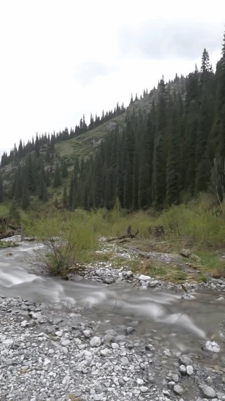

# Long exposure with OpenCV and Python

Emulate long exposure photography techniques. The process of creating a photo that shows the effect of passing time, something that traditional photography does not capture.

Picture to attract attention:

Input                           |  Output
:------------------------------:|:---------------------------------:
 |  

[Everything into this notebook](long-exposure.ipynb)